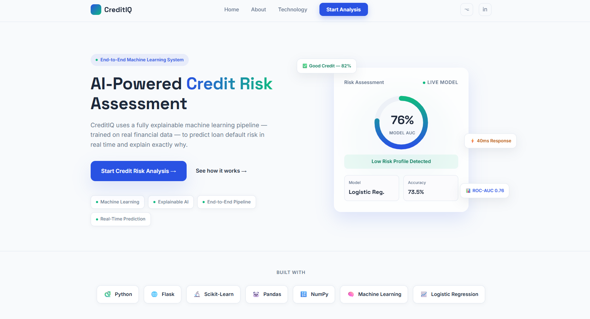
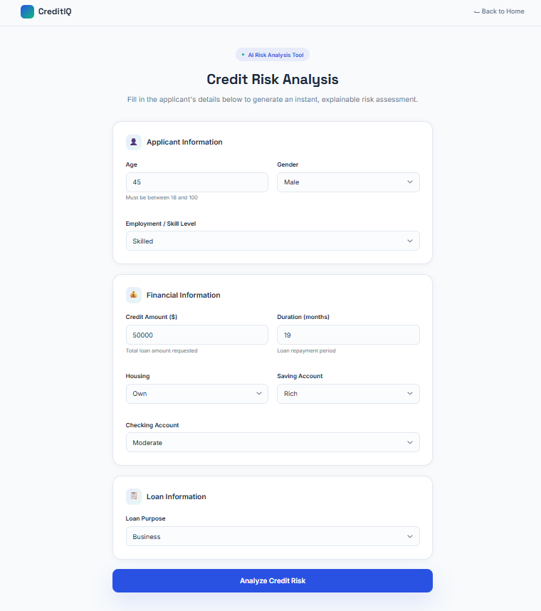
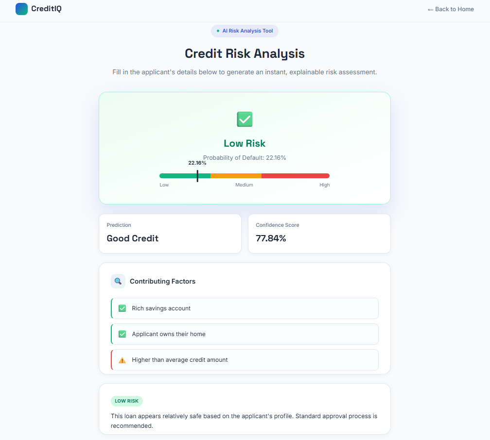

# 💳 CreditIQ

### Predict Smarter. Assess Credit Risk with Confidence.


An end-to-end **Machine Learning** application that predicts whether a loan applicant is likely to be a **Good Credit** or **Bad Credit** risk using a production-ready ML pipeline, an explainable Logistic Regression model, and an interactive Flask web application.

Unlike notebook-only projects, **CreditIQ** demonstrates the complete machine learning lifecycle — from raw data exploration and preprocessing to model selection, explainability, and deployment — making it a practical portfolio project for real-world credit risk assessment.

---

# 📸 Application Preview

## 🏠 Dashboard

---

## 📝 Prediction Page

---

## 🎯 Prediction Results


---
# 🏆 Project Highlights

- ✔ End-to-End Machine Learning Lifecycle
- ✔ Production-Ready Flask Web Application
- ✔ Explainable Logistic Regression Model
- ✔ Leak-Proof sklearn Pipeline
- ✔ ROC-AUC: **0.760**
- ✔ 5-Fold Cross Validation + GridSearchCV
- ✔ Real-Time Risk Assessment
---

# ✨ Features

✔ End-to-End Machine Learning Lifecycle
✔ Leak-Proof Scikit-Learn Pipeline (StandardScaler + OneHotEncoder)
✔ 5-Fold Stratified Cross Validation & GridSearchCV Tuning
✔ ROC-AUC Optimized Model Selection
✔ Explainable AI — coefficient-based, per-applicant reasoning
✔ Real-Time Credit Risk Analysis with Confidence Score & Risk Meter
✔ Client-Side + Server-Side Input Validation
✔ Interactive, Responsive Flask Web Application
✔ Production-Ready Prediction Pipeline (single `.pkl`, zero manual preprocessing)

---

# 📝 What the App Collects

| Applicant Information | Financial Information | Loan Information |
|---|---|---|
| Age | Checking Account | Credit Amount |
| Gender | Savings Account | Loan Duration |
| Job Category | Housing Type | Loan Purpose |

Every prediction returns a **Risk Category**, **Default Probability**, **Confidence Score**, and a **personalized recommendation** — not just a binary Good/Bad label.

---

# 🧠 Explainable AI

Instead of a black-box output, every prediction explains itself:

- Most influential **risk-increasing** factors
- Key **protective** factors
- Overall confidence level
- Probability of default

Since the final model is Logistic Regression, explanations are generated directly from real, learned model coefficients — making every prediction interpretable and business-friendly rather than a guess dressed up as an answer.

---

# 📊 Model Performance

After comparing multiple algorithms using **5-Fold Stratified Cross Validation** and **GridSearchCV**, Logistic Regression was selected as the final model for its balance of performance, stability, interpretability, and inference speed.

| Metric | Score |
|---------|------:|
| Accuracy | **69.0%** |
| Precision | **49.0%** |
| Recall | **81.7%** |
| F1 Score | **61.3%** |
| ROC-AUC | **0.760** |

> **Note:** These metrics reflect a custom decision threshold of **0.25** (instead of scikit-learn's default 0.5), chosen after a precision-recall threshold sweep on the test set. In a lending context, missing an actual defaulter is typically costlier than flagging a good applicant for extra review — so recall was prioritized over raw accuracy. ROC-AUC is unaffected, since it's a threshold-independent metric measuring ranking quality across all possible cutoffs, not just one fixed point.
## 🎯 Why Logistic Regression?

Although Random Forest achieved a marginally higher cross-validation ROC-AUC (0.756 vs 0.755 — within expected validation variance), Logistic Regression was chosen for production because it offers:

- Better interpretability and transparent, coefficient-based explanations
- More stable cross-validation performance (lowest std. deviation of all models tested)
- Faster inference and easier deployment

This makes it particularly suitable for financial applications, where explainability matters as much as raw predictive power.

---

# 💼 Business Problem

Financial institutions face a critical trade-off: approving a high-risk applicant can cause significant losses, while rejecting a creditworthy one means missed business. CreditIQ frames credit assessment as a **binary classification task** and optimizes for **ROC-AUC** rather than raw accuracy, since the dataset's 70/30 class imbalance makes accuracy alone a misleading metric for distinguishing low-risk from high-risk applicants.

---

# 📊 Dataset

- **Source:** German Credit Data (Statlog) — 1,000 records, 10 features
- **Target:** `Risk` — Good Credit (70%) / Bad Credit (30%)

### Key Preprocessing Decisions

- Missing values in **Checking Account** / **Saving Accounts** were preserved as a `"none"` category rather than imputed — missingness itself carried predictive signal (lowest default rate of any group).
- **Credit Amount** outliers were retained — they represented genuine high-value customers, not data errors.
- **Job** was treated as ordinal (not one-hot encoded) since its values already represent increasing skill levels.

---

# 📈 Key EDA Insights

- 📌 **Checking Account** status was the single strongest predictor of credit risk.
- 📌 Customers with **no checking account** showed the lowest default rate of any group.
- 📌 Longer loan **durations** and higher **credit amounts** both correlated with higher default risk.
- 📌 The 70:30 class imbalance made **ROC-AUC** a more reliable metric than accuracy.

---

# 🧠 Machine Learning Pipeline

A single **Scikit-Learn Pipeline** handles preprocessing and prediction end-to-end, guaranteeing identical transformations during training and inference.

```text
Raw Dataset → EDA → Data Cleaning → Train-Test Split
                                          │
                                          ▼
                                  ColumnTransformer
                    ┌──────────────────────┴──────────────────────┐
                    ▼                                              ▼
           Numerical Features                            Categorical Features
     (Age, Job, Credit Amount,                      (Sex, Housing, Saving Accounts,
          Duration)                                  Checking Account, Purpose)
                    │                                              │
              StandardScaler                     OneHotEncoder(handle_unknown="ignore")
                    └──────────────────────┬──────────────────────┘
                                            ▼
                                 Logistic Regression
                                            │
                                            ▼
                     Default Probability → Risk Category → Recommendation
```

Using one unified pipeline eliminates preprocessing inconsistencies and prevents data leakage — both during training and at prediction time.

---

# 📊 Model Comparison

Four algorithms were trained and evaluated using **5-Fold Stratified Cross Validation**, then optimized with **GridSearchCV**:

| Model | Default ROC-AUC | Tuned ROC-AUC |
|---------|---------------:|--------------:|
| Logistic Regression | 0.746 | **0.755** |
| Random Forest | 0.739 | **0.756** |
| AdaBoost | 0.745 | 0.750 |
| Decision Tree | 0.630 | 0.719 |

Decision Tree showed the largest gain from tuning (+0.089), driven mainly by fixing severe overfitting caused by its unconstrained default depth.

---

# 🛠 Tech Stack

| Category | Tools |
|---|---|
| Machine Learning | Scikit-Learn, Pandas, NumPy, Joblib |
| Visualization | Matplotlib, Seaborn |
| Backend | Flask |
| Frontend | HTML5, CSS3, JavaScript |
| Dev Tools | Python 3.13, Jupyter Notebook, Git, GitHub |

---

# 📂 Project Structure

```text
CreditIQ/
│
├── data/
│   ├── raw/german_credit_data.csv
│   └── processed/cleaned_data.csv
│
├── notebooks/
│   ├── 01_EDA.ipynb
│   └── 02_Model_Development.ipynb
│
├── src/
│   ├── predict.py
│   └── utils.py
│
├── models/
│   └── credit_risk_pipeline.pkl
│
├── flask_app/
│   ├── app.py
│   ├── model/credit_risk_pipeline.pkl
│   └── templates/
│       ├── dashboard.html
│       └── prediction.html
│
├── images/
│   ├── dashboard.png
│   ├── prediction-page.png
│   └── prediction-result.png
│
├── requirements.txt
├── README.md
└── .gitignore
```

---

# 🚀 Installation & Setup

```bash
# Clone the repository
git clone https://github.com/Prasad-j1/CreditIQ.git
cd CreditIQ

# Create virtual environment
python -m venv venv
venv\Scripts\activate        # Windows
source venv/bin/activate     # Linux / macOS

# Install dependencies
pip install -r requirements.txt

# Run the application
cd flask_app
python app.py
```

Then open **http://127.0.0.1:5000** in your browser.

---

# ▶️ Usage

1. Launch the Flask application and open the dashboard.
2. Click **Start Credit Risk Analysis**.
3. Enter applicant information across all three sections.
4. Submit the prediction request.
5. Review the risk category, probability, confidence score, and recommendation.

---

# 🔮 Future Improvements

- Batch prediction via CSV upload
- SHAP-based feature explanations
- User authentication & prediction history
- Model monitoring / drift detection
- Docker containerization & cloud deployment (Render / Railway)
- Gradient Boosting / XGBoost comparison

---

## 👨‍💻 Author

**Prasad S. Joshi**

- GitHub: https://github.com/Prasad-j1
- LinkedIn: https://www.linkedin.com/in/prasad-joshi-8496b12a6

---

## ⭐ Support

If you found this project helpful, consider giving it a **⭐ Star** on GitHub — it helps increase visibility and motivates future improvements.

---

> **CreditIQ** demonstrates the complete machine learning lifecycle — from raw data exploration and preprocessing to model selection, explainability, and deployment — showcasing how predictive analytics can support smarter, more transparent credit risk assessment.
